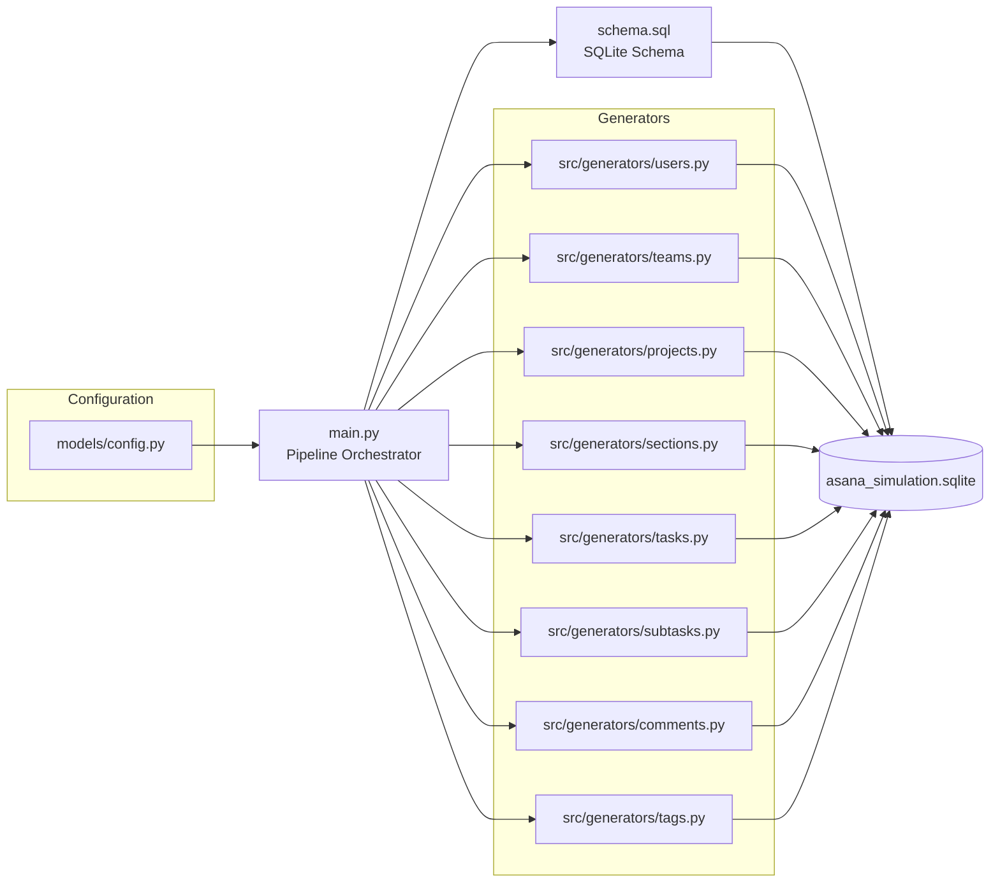

# Asana RL Seed Data Generator

## Overview

This repository provides a complete, reproducible pipeline for generating high-quality synthetic seed data for a **reinforcement learning (RL) environment** simulating **Asana**, an enterprise project management platform.

The generated dataset models a realistic **B2B SaaS organization** (~7,000 users) using Asana across **Product**, **Marketing**, and **Operations** teams. The primary goal is to create data that supports meaningful evaluation and fine-tuning of **computer-use AI agents**, while avoiding unrealistic shortcuts or uniform distributions.

The output is a fully populated **SQLite database** representing a realistic Asana workspace, including:

- Tasks  
- Subtasks  
- Comments  
- Collaboration metadata  

This dataset can be used for testing RL agents in a realistic enterprise collaboration setting.

## Features

- Realistic user and team structure across multiple departments  
- Task hierarchies with subtasks  
- Rich metadata including comments and collaboration events  
- Fully reproducible synthetic dataset  

## Getting Started

1. Clone the repository:
    ```bash
    git clone <repository-url>
    ```
2. Follow the instructions in the pipeline scripts to generate the synthetic database.  

## Use Cases

- Training reinforcement learning agents for productivity tools  
- Evaluating AI agents in realistic task and collaboration scenarios  
- Testing analytics or reporting algorithms on enterprise task data  

---

## Repository Structure
```bash
asana-rl-seed/
├── README.md                    # Project documentation
├── requirements.txt             # Python dependencies
├── schema.sql                   # SQLite database schema (DDL)
├── .env.example                 # Example environment configuration
├── src/
│   ├── main.py                  # Pipeline orchestration
│   ├── generators/              # Data generation modules
│   │   ├── users.py
│   │   ├── teams.py
│   │   ├── projects.py
│   │   ├── sections.py
│   │   ├── tasks.py
│   │   ├── subtasks.py
│   │   ├── comments.py
│   │   └── tags.py
│   ├── models/
│   │   └── config.py            # Central configuration
│   └── utils/                   # Helper utilities
├── prompts/                     # Prompt templates (if applicable)
└── output/
    └── asana_simulation.sqlite  # Generated SQLite database

```
---

## Schema Overview

The database schema models the following core entities:

- `organizations`  
- `users`  
- `teams`  
- `team_memberships`  
- `projects`  
- `sections`  
- `tasks`  
- `subtasks`  
- `comments`  
- `tags`  
- `task_tags`

---



---

**Relationships enforce:**

- Hierarchical task structure  
- Team-scoped projects  
- Realistic user assignments  
- Referential integrity across all entities  

## **Entity-Relationship Diagram (ERD)** is provided separately in the documentation (generated using dbdiagram.io) [Database Diagram](https://dbdiagram.io/d/Aasna-db-diagram-2-695ea11b39fa3db27b6105ba)
.

---

## Data Generation Pipeline

The pipeline is orchestrated via `src/main.py` and executed top-to-bottom in a single database connection.

### Execution Order

1. Initialize schema  
2. Insert organization  
3. Generate users  
4. Generate teams and team memberships  
5. Generate projects  
6. Generate sections  
7. Generate tasks  
8. Generate subtasks  
9. Generate comments  
10. Generate tags  

Each step commits data incrementally while preserving consistency.

---

## Data Realism Highlights

### Users
- ~7,000 users  
- ~5% admins, ~95% members  
- ~95% active users  
- Company-domain emails with collision-safe disambiguation  
- Join dates spread across the last 24 months  

### Teams
- Product, Marketing, Operations  
- Non-uniform team sizes  
- Cross-functional membership for a minority of users  

### Projects
- Team-scoped  
- Start and due dates included  
- Status distribution: planned / active / completed  

### Tasks
- ~40–60 tasks per project  
- Section distribution:  
  - ~45% To Do  
  - ~35% In Progress  
  - ~20% Done  
  - ~15% unassigned tasks  
- Due dates clustered around project deadlines  
- Includes overdue and undated tasks  

### Subtasks
- ~30% of tasks have subtasks  
- 2–5 subtasks per parent task  
- Hierarchical completion consistency enforced  

### Comments
- 0–5 comments per task  
- Authored by assignee or teammates  
- Timestamps always within task lifetime  

### Tags
- Shared tag vocabulary  
- ~40% of tasks tagged  
- 1–2 tags per task  

---

## Temporal Consistency Guarantees

The generator enforces strict temporal rules critical for RL policy learning:

- Tasks are never completed before creation  
- Subtasks follow parent task timelines  
- Comments occur after task creation and before completion  
- Project start dates precede due dates  

---

## Relational Integrity

All relationships are enforced using **foreign keys** and controlled insertion logic:

- Users must belong to an organization  
- Team memberships reference valid users and teams  
- Tasks reference valid projects and sections  
- Subtasks reference valid parent tasks  
- Comments reference valid tasks and authors  
- Task-tag relationships are many-to-many  

---
## Requirements

- **Python 3.10+**  
- **SQLite** (bundled with Python)  
- Python packages:
  - `faker`  

Install dependencies:

```bash
pip install -r requirements.txt
```
## How to Run

### 1. Generate the database

From the project root:

```bash
python src/main.py
```
### This will create:
```bash
output/asana_simulation.sqlite
```
### 2. Inspect the database (optional)
```bash
sqlite3 output/asana_simulation.sqlite
```

### Example checks:
```bash
.tables
SELECT COUNT(*) FROM users;
SELECT COUNT(*) FROM tasks;
SELECT COUNT(*) FROM comments;
```
---
### Reproducibility

- The pipeline is deterministic up to random seeds

- Deleting the SQLite file and re-running regenerates the dataset

- All configuration values are centralized in models/config.py
---
### Design Trade-Offs

- Custom fields are documented conceptually but not physically implemented to reduce schema complexity
- Projects are team-scoped to minimize ownership ambiguity
- Subtasks store project_id as a denormalization for RL efficiency
- All trade-offs are intentional and documented
---
### Intended Use
This dataset is designed for:
- Reinforcement learning environment simulation
- Evaluation of computer-use AI agents
- Research on task planning and workflow automation
- Synthetic benchmarking of enterprise productivity tools
---
## bLicense

This project is provided for evaluation and research purposes only.
---
## Author Notes

This repository was created as part of a Research Scientist Internship take-home assignment, with emphasis on realism, methodological rigor, and research-grade documentation.

